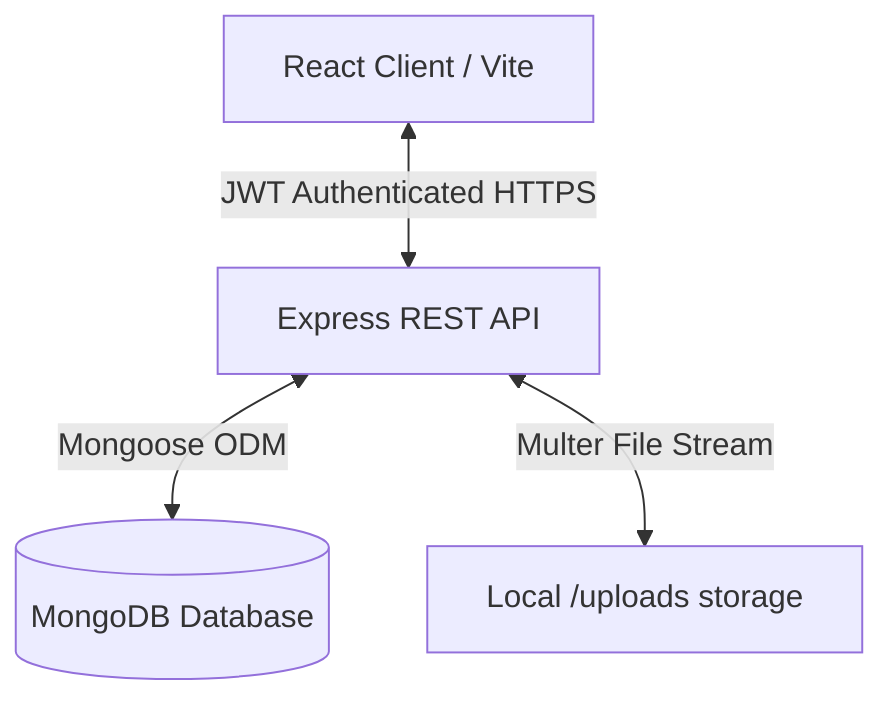

# Project Analysis: Private MERN Journaling Platform

This document serves as the high-seniority technical reference mapping the entire application architecture, recursive file tree, core features, and current system capabilities.

---

## 1. High-Level Architecture

The platform is a secure, personal journaling tool designed using the MERN stack with strict data isolation, premium UI aesthetics (Obsidian Dark & Stone Light), and built-in data portability.



### Technical Stack Summary
- **Backend:** Node.js + Express.js + Mongoose ODM (MongoDB).
- **Frontend:** React (Vite) + Tailwind CSS + Lucide Icons + Recharts.
- **Rich Text Engine:** React-Quill integration.
- **Security:** Class-based JWT authorization, Helmet, CORS policies, and rate-limiting (`express-rate-limit`).
- **Data Portability:** Encrypted Zip streams utilizing `archiver` (ZipCrypto) and in-memory extraction via `unzipper`.

---

## 2. Platform Feature Map

### 🖋️ Rich-Text Journaling Engine
- **Quill-Powered Editor:** Dynamic editing supporting **Bold**, *Italics*, Headers, and bulleted/numbered lists.
- **Draft & Edit Isolation:** Clear structural division between Read-Only (viewing) and Sandbox (editing) modes.
- **Legacy Compatibility Layer:** Legacy plain-text journal entries (containing `\n` linebreaks) are dynamically converted to HTML `<br>` tags on the fly during render to prevent content smashing.
- **Smart Uploads:** Supports drag-and-drop uploads as well as an accessible "Upload Photo" button for mobile screens.

### 📊 Reflection & Analytics Engine
- **Streak Calculation:** Custom algorithm evaluating chronological journal dates to report the exact current consecutive writing streak alongside the best all-time streak.
- **Mood Visualizer:** A beautiful `recharts` Bar Chart distributing recorded moods (`Happy`, `Neutral`, `Sad`, `Angry`, `Productive`, `Tired`).

### 🖼️ Sequential Media Gallery
- **Chronological Grid:** Renders all photos uploaded across all historical entries.
- **Interactive Lightbox:** Allows seamless left/right chevron navigation through all photos across all entries sequentially without having to close the modal.

### 📁 Soft-Delete Archive
- **Safe Retention:** Journal entries can be temporarily archived, removing them from the main dashboard without hard-deletion.
- **Purge Control:** Users can restore archived entries or permanently delete them from the system.

### 🔒 Enterprise-Grade Backup & Restore
- **Secure Export:** Packages all text records (`journals.json`) and physical file uploads into a single `.zip` file secured using Windows/Mac native password protection (ZipCrypto).
- **Smart Import & Conflict Resolution:**
  - **Smart Merge:** Prevents duplicate items and uses an `updatedAt` comparison algorithm to ensure the newest edits survive.
  - **Force Rollback:** Clears the current database state to restore the exact state of the backup.

---

## 3. Directory File Tree

```text
.
├── client/
│   ├── index.html                    # Single Page App wrapper
│   ├── package.json                  # React dependency tree (react-quill, recharts, tailwindcss)
│   ├── postcss.config.js
│   ├── tailwind.config.js            # Custom design tokens (Obsidian, Terracotta, Amethyst, Stone)
│   ├── vite.config.js                # Vite asset building bundler
│   └── src/
│       ├── App.jsx                   # Entry router mapping Auth, Layout & Navigation
│       ├── main.jsx                  # React runtime bootstrapper
│       ├── index.css                 # Custom scrollbars & Quill overrides
│       ├── config.js                 # API server bindings
│       ├── components/
│       │   ├── Layout.jsx            # Main app shell containing persistent navigation
│       │   ├── Navbar.jsx            # Multi-view navigation panel
│       │   └── ProtectedRoute.jsx    # Session-aware client-side shield
│       ├── context/
│       │   ├── AuthContext.jsx       # State for session, login/logout, and role management
│       │   ├── SettingsContext.jsx   # State for system settings
│       │   └── ThemeContext.jsx      # Class-based Dark/Light toggles
│       ├── pages/
│       │   ├── AdminDashboard.jsx    # Platform management interface
│       │   ├── Analytics.jsx         # Mood metrics and streaks visualizer
│       │   ├── Archive.jsx           # Safe-deleted entries repository
│       │   ├── Gallery.jsx           # Media repository & carousel modal
│       │   ├── JournalDashboard.jsx  # Main feed displaying journal preview cards
│       │   ├── JournalEditor.jsx     # Rich text editor (React-Quill integration)
│       │   ├── Login.jsx             # Secure login forms
│       │   └── UserSettings.jsx      # Password change and backup/restore controls
│       └── services/
│           └── api.js                # Axios instance with request/response interceptors
│
├── server/
│   ├── index.js                      # Express Server core (Helmet, Rate-limit, and Port configurations)
│   ├── package.json                  # Backend dependencies (archiver, unzipper, bcrypt, jwt)
│   ├── config/
│   │   └── db.js                     # MongoDB connection pool setup
│   ├── controllers/
│   │   ├── adminController.js        # Admin settings controllers
│   │   ├── authController.js         # Register, Login, and Password handlers
│   │   ├── backupController.js       # Password-protected zipping & unzipping merge algorithms
│   │   ├── imageController.js        # Handles image uploads and deletes
│   │   ├── journalController.js      # CRUD actions for journal entries
│   │   └── settingsController.js     # Globally shared settings handlers
│   ├── middleware/
│   │   └── authMiddleware.js         # JWT validator & role authorization checkers
│   ├── models/
│   │   ├── Image.js                  # Image metadata schemas
│   │   ├── Journal.js                # Journal schemas (rich HTML, tags, moods, relationships)
│   │   ├── Settings.js               # Global site brand schemas
│   │   └── User.js                   # Authenticated user profiles
│   ├── routes/
│   │   ├── adminRoutes.js
│   │   ├── authRoutes.js
│   │   ├── imageRoutes.js
│   │   ├── journalRoutes.js
│   │   └── settingsRoutes.js         # Backup routes & brand management
│   ├── scripts/
│   │   └── seedAdmin.js              # Admin initialization tool
│   └── uploads/                      # Physically uploaded image repository
```

---

## 4. Current State & Technical Debt
- **Deployment Preparation:** Next phase requires configuring a robust production ecosystem.
- **Task List:**
  1. Configure `ecosystem.config.cjs` for PM2 process clustering and auto-reloading.
  2. Implement local Nginx templates for handling secure SSL reverse-proxying.
  3. Validate client asset production builds via `npm run build`.
